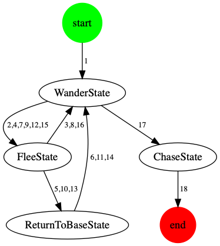

# go-fsm [](https://godoc.org/github.com/austingebauer/go-fsm)

A golang library that can be used to construct finite-state machines.

A finite-state machine is an abstract machine that can be in exactly one of a finite number of states at any 
given time.

The API and design of this library is inspired by the finite-state machine implementation in the [golang template lexer](https://github.com/golang/go/blob/master/src/text/template/parse/lex.go#L105)

## Installation

```bash
go get github.com/austingebauer/go-fsm
```

## Usage

See example usage in [example/main.go](./example/main.go), which uses go-fsm to write a finite-state machine for the 
[pacman ghosts state machine](https://bits.theorem.co/images/posts/2015-01-21-state-design-pacman-fsm.png).

To run the example:
```bash
go run example/main.go
```

## Generating a State Diagram

To generate a state diagram showing the states, transitions, and steps of the finite-state machine execution:
```bash
dot example/dot_graph.gv -T png > example/dot_graph.png && open example/dot_graph.png
```

An example image generated from running the example finite-state machine:


